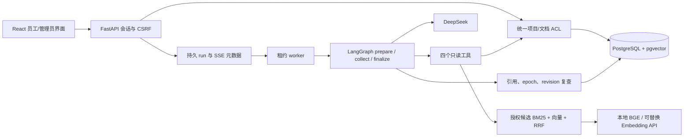

# 实现架构与边界

## 实现选择

- 路由位于 `backend/src/knowledge_agent/api.py`；业务拆为 security/documents/retrieval/runs/agent/worker 等模块。
- 项目人员以 projects.people JSON 保存；更新项目时一并更新 revision/updated_at。消息以一条 run 的问题及终态答案保存；幂等唯一约束避免重复消息与答案。
- 组织/用户/用户组 ACL 由服务端判断，关联文档和项目取交集。先加载可见文档 ID，再读取相应版本和片段，受限正文不进入模型。
- pgvector 保存向量，在数据库内对已授权版本进行精确余弦排序并返回前 20 个候选；分词/BM25 使用容量受限缓存。尚无 ANN 索引，不能宣称已测大规模检索。
- 全局 epoch 事务递增；会话、run、SSE、最终生成上下文均复查。项目事实另外核对 revision，历史资料标注版本与有效区间。
- 文档原件只由解析 worker 读取。Python 子进程隔离模型凭证并设超时；Linux 设内存/CPU 限制，Compose 进一步约束内存/PID。Windows 仅完成进程超时验证。
- 任务租约带 generation，旧 worker 不得写回。查询恢复重新进入图并重新读取动态事实，原 run 的调用次数、同参数计数和 deadline 不重置。PostgresSaver 保存每次执行代次的图状态，不直接复用旧证据正文。
- 每个会话由数据库局部唯一索引保证最多一个 queued/running/interrupted；过期任务变 failed。SSE 仅传阶段与终态通知，答案由鉴权接口重新读取。
- 聊天记录长期保留，读取时重新检查引用权限；知识更新后可在原会话继续查询，旧 epoch 回答不进入模型上下文。7 天前创建且已过期会话仅清理执行检查点。文档 tombstone 后立即不可读，worker 异步删除原件与向量，清理失败支持管理端重试。

## 模型与检索

DeepSeek 使用 [官方 API](https://api-docs.deepseek.com/)；可用模型通过 `/models` 验证。Embedding 是不同接口能力，默认 [BAAI/bge-small-zh-v1.5](https://huggingface.co/BAAI/bge-small-zh-v1.5)，[配置标注 512 维](https://huggingface.co/BAAI/bge-small-zh-v1.5/raw/main/config.json)。权重只在下载步骤联网，服务启动使用 local_files_only 和 trust_remote_code=False。

LangGraph 持久化采用 [PostgresSaver](https://docs.langchain.com/oss/python/langgraph/persistence)，向量字段采用 [pgvector-python](https://github.com/pgvector/pgvector-python)。本机已执行 PostgreSQL 迁移、锁竞争和 saver 重启测试，结果见 ACCEPTANCE.md；Compose/远程 CI 独立标注验证状态。

## 当前仍需专项验收的约束

总 deadline 在调用前后检查；HTTP 适配器通过 asyncio.timeout 限制完整响应，已测慢速持续响应。Embedding 与 reranker 共享工具剩余时间；模型输入有字节上限。大语料 CPU 检索压力和全文事实语义支持仍需分别进行规模压测和人工评测。
